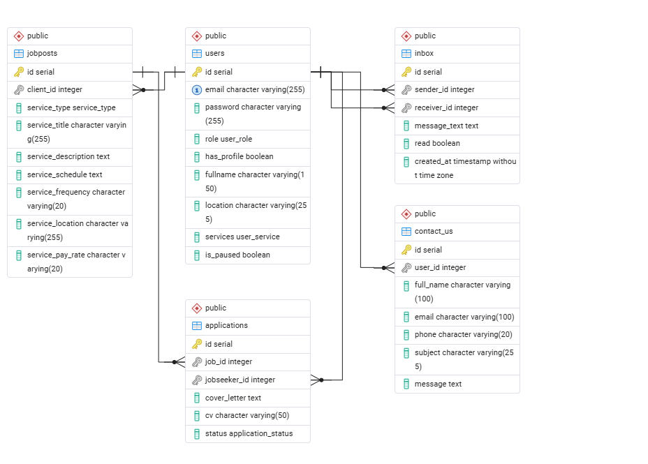

# GFE-Project

# GFE — Gig For Everyone

A web platform connecting people who need small local jobs done with trusted, verified workers.

## Team
- Mashair
- Upeksha
- Diem Tran

## Tech Stack
- **Frontend:** HTML, CSS, JavaScript
- **Backend:** Node.js, Express.js
- **Database:** PostgreSQL
- **Deployment:** Render 

## Features
- User Authentication (Register, Login, Logout)
- Gig Browsing and Searching
- Gig Posting and Management
- Job Seeker Profile and Dashboard
- Client Profile and Dashboard
- Candidate Search and Applicant Management
- Job Application Tracking
- Messaging System
- About Us and FAQ

## Pages
- Landing Page
- Login / Register
- Browse Gigs
- Post a Gig
- Job Seeker Profile
- Job Seeker Dashboard
- Client Profile
- Client Dashboard
- Candidate Search
- Inbox
- About Us
- FAQ

## Project Structure
```
gfe-project/
├── frontend/
│   ├── Assets/
│   ├── css/
│   ├── js/
│   └── *.html
├── backend/
│   ├── helpers/
│   ├── routes/
│   ├── uploads/
│   ├── client.rest
│   ├── index.js
│   ├── gfe.sql
│   └── package.json
└── README.md
```
## Database ER Diagram


## Course
Web Programming Project — ID00DW07-3003  
Oulu University of Applied Sciences (Oamk)  
Sprint period: 16.3 – 24.4.2026  
Final presentation: 29.4.2026

## Project Purpose
This project was developed as part of the Web Programming course at Oamk. The goal was to design and implement a full-stack web application that solves a real-world problem while applying modern web development practices.